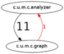

cycles-maven-plugin
===================

The Maven Cycles Plugin detects package dependency cycles and suggests
dependencies that should be removed to get back to an acyclic package graph.

The plugin tries to suggest those dependencies for removal that go from stable 
to unstable packages, i.e., from packages with a high in-degree to those with 
a high out-degree.

Example Usage
-------------

    mvn cycles:cycles

outputs the package cycles and suggests dependencies that should be removed to break those cycles
within a Java project. This is the output when invoking on a version of the plugin itself that has a cycle
added to it for demonstration purposes:

    [INFO] --- cycles-maven-plugin:1.1.0-SNAPSHOT:cycles (default-cli) @ cycles-maven-plugin ---
    === Cycle / strongly connected component (2 packages, 2 dependencies)
    
    = Packages
    c.u.m.c.analyzer
    c.u.m.c.graph
    
    = Dependencies
    c.u.m.c.analyzer -> c.u.m.c.graph [11]
    c.u.m.c.graph -> c.u.m.c.analyzer [1]
    
    = Cycle-breaking dependencies
    c.u.m.c.graph -> c.u.m.c.analyzer [1]

Other features include:

  * Output of cycles in [Graphviz](http://www.graphviz.org) format for visualization:
  
      
  * Aggregation of packages to a certain depth
  * Optional inclusion of test classes
  * Output of the class-level dependencies

Refer to the Maven site documentation for more details.
